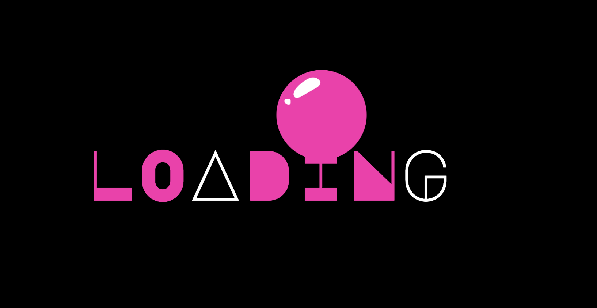

# 🎈 Bubble Loader Animation

A smooth bubble loading animation built with **HTML & CSS**.  
Perfect for splash screens, loading pages, or creative websites.  

## 🚀 Demo
[Live Preview]( https://nazia-99.github.io/Bubble-Loader-Animation/
Last deployed by @Nazia-99 Nazia-99 2 minutes ago
)  

## 📂 Project Structure
│── index.html # Main HTML
│── code-with-nazia.css # CSS styles
│── README.md # Project info


## 🛠️ Tech Used
- HTML5
- CSS3 (Flexbox + Animations)
- Google Fonts (Major Mono Display)

## 📸 Preview


## ⚡ How to Use
1. Clone the repo:
   ```bash
   git clone https://github.com/yourusername/bubble-loader.git
   

Made with ❤️ by Nazia99
